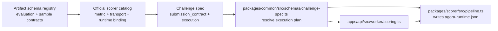

# Scoring Extension Guide

## Purpose

How to extend the official scoring runtime without spreading logic across the
worker, API, and web app.

## The extension boundary

Agora treats scoring extensibility as three small concepts, but only one of
them is allowed to define official runtime capability:

1. **Official scorer catalog** in `packages/common/src/official-scorer-catalog.ts`
2. **Authoring artifact schema registry** in `packages/common/src/authoring-artifact-schemas.ts`
3. **Generic scorer execution** in `packages/scorer/src/pipeline.ts`

Challenge type and domain catalogs remain centralized in:
- `packages/common/src/types/challenge.ts`

The worker, API routes, score jobs, proofs, and indexer should not need product-specific edits for a normal new scoring method.

ELI5:

- `official-scorer-catalog.ts` decides which official scorer capabilities exist
- `authoring-artifact-schemas.ts` defines the machine-readable artifact shapes
- `pipeline.ts` stages files, writes the scorer runtime config, and runs Docker
- the worker just asks common for the resolved plan and executes it

## File map

### `packages/common/src/official-scorer-catalog.ts`

Use this when you need a new official scoring method that Agora will ship and support.

Each catalog entry owns:

- template id
- versioned scorer capability family
- container image
- runner limits
- supported metrics
- allowed policies
- compatible evaluation/submission contract-kind pairs
- transport support per submission kind
- non-routing authoring guidance strings for agents and UI copy
- official release-platform contract (`linux/amd64` and `linux/arm64`)

This is the only official scoring config layer.

It is also the only official authoring capability layer for standard scoring.
Adding a normal scorer should be additive here, not a new route branch or a new
compiler-only classifier.

### `packages/common/src/authoring-artifact-schemas.ts`

Use this when a scorer capability needs a machine-readable contract for:

- hidden evaluation artifacts
- sample submission artifacts
- canonical examples and validation hints exposed to agents

This file owns:

- versioned `schema_id` definitions
- artifact kinds and allowed extensions
- expected bundle structure hints
- example payload shapes for capability discovery

This file does **not** own:

- scorer image selection
- worker execution behavior
- challenge-spec routing

The worker hot path reads the resolved submission contract and scoring env from
the `challenges` table first. Pinned-spec reads are only for local/public
verification paths outside the worker hot path.

Official scorer catalog entries may also declare scorer-facing runtime defaults that
the pipeline serializes into `/input/agora-runtime.json` for the container.

## Registry contract

The official scorer catalog is both:

- the only official runtime capability registry
- the only official authoring-discovery registry for standard scoring

That means the catalog entry shape must be explicit and validated in
`@agora/common`, not left as an informal TypeScript object.

Each official scorer entry should define exactly:

- template id
- capability family version
- pinned image digest and release tag
- supported metrics
- supported submission kinds
- compatible evaluation/submission contract-kind pairs
- mount defaults per supported transport
- runner limits
- authoring support flags
- human guidance metadata for each supported submission kind
- optional evaluator archetype metadata per supported transport
- optional scorer discovery metadata for internal authoring assistance

Human guidance metadata is descriptive only. It exists so agents and UI copy can
explain:

- what the hidden evaluation artifact represents
- what solvers submit
- what dry-run will do
- whether a sample submission is required
- which common use cases this scorer capability fits
- which follow-up topics a poster will likely need to clarify

It must not become a second routing surface.

Every official capability must also make its dry-run contract explicit. Registry
metadata and scorer behavior must agree on whether the capability uses:

- a synthetic submission derived from hidden evaluation data
- a rubric-derived synthetic submission for structured validation
- or a poster-supplied sample submission artifact

Do not rely on vague “JSON support” or “opaque support” labels alone. The capability
must define the exact deterministic dry-run strategy that gets a session to
`ready`.

For the current structured-record validation capability, keep the rubric contract
explicit and narrow:

- `required_fields` or legacy alias `required_sections`
- `non_empty_array_fields`
- `allowed_string_values`

If the scorer grows beyond that, update the shared rubric schema in
`@agora/common` and the scorer runtime together.

For execution-judge capabilities, keep the first slice equally narrow:

- one official template version at a time
- one runtime/language contract at a time
- one explicit dry-run strategy, usually a poster-supplied sample submission
- one explicit harness-bundle format

For example, `official_code_execution_v1` should not try to cover Python,
JavaScript, notebooks, and archives all at once. Start with one Python
single-file harness contract, ship it, then widen later if the scorer and
registry contract remain clean.

Do not add a public `evaluation_mode` enum or a parallel authoring classifier.
Standard authoring resolves the scorer capability family from the metric first,
then validates that the requested `submission_kind` is one of the transports
the resolved family supports.

The guidance strings help explain the scorer capability. They do not choose it.

Internal authoring assistance may read additional registry metadata such as:

- evaluator archetype ids
- use-case lists
- follow-up topic lists
- keyword hints

That assistance must still compile into the same registry-backed model:

- `metric -> template`
- `submission_kind` validated as a supported transport under that template

The registry is the only thing the worker trusts. Interactive authoring help is
allowed to suggest capabilities and transports, but not to invent a second
execution model.

## Registration principles

When adding a new official scorer, follow these rules:

- extend the validated catalog contract first
- keep runtime capability and authoring capability in the same entry
- keep human guidance in metadata strings, not routing enums
- do not add worker, API, or indexer branches for normal scorer additions
- if a mount filename convention changes, ship a new template version instead of
  mutating an existing one in place

Versioning rule:

- changing container image behavior only -> publish a new image and update the
  registry to the immutable `sha-<git-commit>` tag plus pinned digest for that
  image
- changing the scorer contract shape or mounted filenames -> publish a new
  template id such as `official_*_v2`

Stable tags such as `:v1` may still exist as release aliases, but the official
registry should prefer the immutable `sha-<git-commit>` tag when binding a
template to a concrete published image.

### `packages/common/src/schemas/challenge-spec.ts`

This is where the shared contract is validated and turned into a resolved runtime plan.

It owns:

- execution-to-catalog validation
- scoreability validation
- challenge-spec-to-execution-plan derivation for worker/scorer/oracle use

### `packages/scorer/src/pipeline.ts`

This is the generic runtime path.

It owns:

- staging evaluation bundle + submission files into the workspace
- writing `/input/agora-runtime.json` from execution-plan defaults + submission contract
- pre-scoring contract validation
- running the Docker scorer
- DB-first runtime config resolution, with pinned-spec reads only where local or public verification still needs them

## Add a new official scoring method

1. Add or update the catalog entry in `packages/common/src/official-scorer-catalog.ts`.
2. Publish the scorer Docker image.
   - the canonical registry input tag should be `sha-<git-commit>`
   - official scorer tags must publish as a multi-arch manifest list for
     `linux/amd64` and `linux/arm64`
3. If the new method introduces a new evaluation artifact or sample-submission contract, add a versioned schema entry in `packages/common/src/authoring-artifact-schemas.ts`.
4. Add tests in:
   - `packages/common/src/tests/*`
   - `packages/scorer/src/tests/*`
   - worker/runtime plan tests

That is the normal path. You should not need:

- a new worker branch
- a new scorer adapter directory
- a new runtime registry file
- a separate official image whitelist

## Add a new challenge family

Use this path only for product metadata or UX labeling that does not create a
second scoring model.

1. Add the new challenge type/domain value in `packages/common/src/types/challenge.ts`.
2. Update any user-facing copy or capability presentation that refers to that product family.
3. Only add a scorer catalog entry if Agora is actually shipping a new official runtime, not just a new UX label.
4. Update docs/tests.

## ELI5 file map

- `packages/common/src/official-scorer-catalog.ts`
  - "What official scorer capability exists, and which transports and metrics does it support?"

- `packages/common/src/authoring-artifact-schemas.ts`
  - "What does the hidden evaluation bundle or sample submission need to look like?"

- `packages/common/src/schemas/challenge-spec.ts`
  - "Given a challenge spec, what is the final scoring plan?"

- `packages/scorer/src/pipeline.ts`
  - "Take that plan, stage the files, and run Docker."

- `apps/api/src/worker/scoring.ts`
  - "Score one queued submission and build a proof."

- `apps/api/src/routes/authoring-sessions.ts`
  - "Own the agent authoring lifecycle and call the shared challenge-spec builder."

## What should stay unchanged

Adding a normal scoring method should not require changing:

- worker job state transitions
- score-job queue handling
- API challenge routes
- proof bundle storage
- indexer event handling
- deployment scripts beyond reading the official scorer catalog

If a new scoring method needs edits in those layers, the design is probably too coupled.

## Guardrails

- Official runtime support must come from exactly one catalog. Do not add a
  second image whitelist or metric-routing table.
- Official scorer release tags must stay multi-arch for `linux/amd64` and
  `linux/arm64`.
- `challenge_type` is an authoring/product concept. It must not route worker
  execution.
- The canonical worker cache is `execution_plan_json`, not a hand-built mirror
  of the challenge spec.
